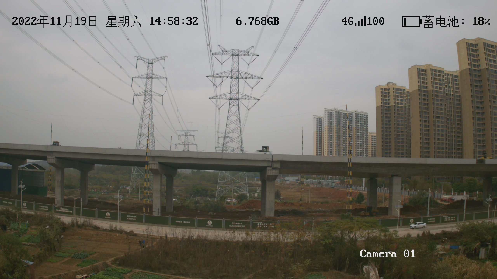
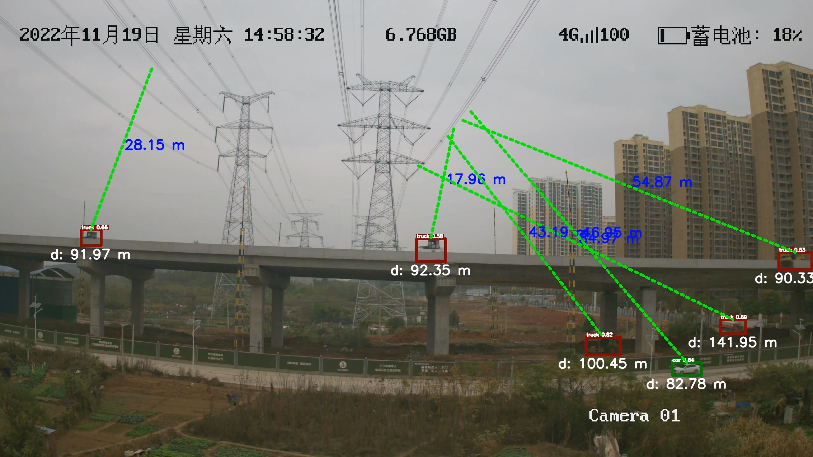

This package provides an implementation of the prediction and analysis of our paper work **"Lightweight vision architecture deployed in the terminal for safety monitoring and early warning of transmission lines"**.

This repository provides the **inference-stage code** of the proposed method, including **PC-side inference** and **terminal deployment on RKNN (e.g., RK3588)**.

---

## Highlights

* **End-to-end inference pipeline** for hazard detection and monitoring.
* **Ready-to-run demos** for both **image** and **video** inference.
* **Terminal deployment workflow**: PyTorch → ONNX → RKNN → on-device inference.

---

## Part I — PC-Side Inference

### 1) Recommended Environment

* OS: Windows / Linux
* Python: 3.9 (recommended)
* PyTorch: 2.0.1 (recommended for `.pt` checkpoint compatibility)
* OpenCV: opencv-python

GPU acceleration is supported if a CUDA-enabled PyTorch build is installed.

---

### 2) Installation

Install all dependencies with:

```shell
python -m pip install -r requirements.txt
```

---

### 3) Quick Start

#### Image demo (test.jpg)

Run inference on a single image:

```shell
python detect.py --weights runs/train/exp/weights/best.pt --conf 0.25 --img-size 640 --source data/test.jpg
```

Output:

* The prediction result will be saved under `runs/detect/` by default.
* Example output file: `runs/detect/test.jpg`.

**Input (data/test.jpg)**


**Output (runs/detect/test.jpg)**


---

#### Video demo (video.mp4)

Run inference on a video:

```shell
python detect.py --weights runs/train/exp/weights/best.pt --conf 0.25 --img-size 640 --source data/video.mp4
```

Output:

* The output video will be saved under `runs/detect/` by default.
* The output visualization is consistent with the results shown in the revised manuscript (**Supplementary Video 1.mp4**).

---

## Part II — Terminal Deployment (RKNN / RK3588)

This part provides a standard deployment pipeline for Rockchip NPU platforms (e.g., RK3588):

1. Export the PyTorch model to ONNX using `export.py`
2. Convert ONNX to RKNN using **rknn-toolkit2**
3. Run the RKNN inference demo on the terminal device using `RKNN/demo_rknn.py`

---

### 1) Export to ONNX (on PC)

Export command (example for RK3588):

```shell
python export.py --rknpu RK3588 --weight runs/train/exp/weights/best.pt
```

After export, an ONNX model file will be generated (the exact filename depends on `export.py`).

---

### 2) Convert ONNX to RKNN (host-side conversion)

Recommended toolchain:

* rknn-toolkit2 (ONNX → RKNN)

Typical pipeline:

best.pt → export.py → model.onnx → rknn-toolkit2 → model.rknn

Suggested host environment:

* OS: Linux (recommended)
* Python: 3.8/3.9 (depending on rknn-toolkit2 version)

Please follow the official Rockchip documentation for installing and configuring **rknn-toolkit2**.

---

### 3) Run on RKNN Terminal Device (RK3588)

On the terminal device, enter the RKNN folder and run the demo:

```shell
cd RKNN
python demo_rknn.py
```

Notes:

* Please ensure the RKNN runtime is installed on the terminal device (`rknn-runtime`).
* Required parameter files are provided under `RKNN/parameters/` and will be used during inference.

---

### 4) RKNN Runtime Environment (example)

* Device: RK3588 (or compatible Rockchip NPU platform)
* OS: Linux (Ubuntu-based distributions commonly used)
* Python: 3.8/3.9 (depending on runtime/toolkit)
* Dependencies:

  * rknn-runtime
  * numpy
  * opencv-python
  * other dependencies required by `demo_rknn.py`

---

## License

This project is released under the license specified in the LICENSE file.
